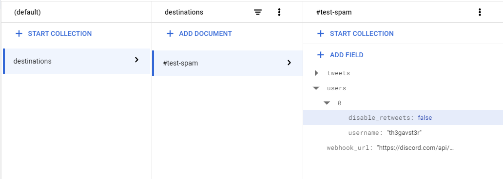

# Twitter to Discord

Scrapes user timelines and automatically posts tweets to a Discord channel.

## Configuration

This app relies on a manually-populated Firestore collection to configure watched Twitter users and target Discord channels. To get started, follow the first section of the [quickstart](https://cloud.google.com/firestore/docs/create-database-web-mobile-client-library#create) to create a Firestore database.

Next you will need to create a collection called `destinations` to store your Discord channels. The documents must have a `webhook_url` which you [create for your target channel](https://support.discord.com/hc/en-us/articles/228383668-Intro-to-Webhooks).

Lastly you will need to populate `document.users` with an array of Twitter usernames you'd like to watch.

## Scheduling

You can follow [this guide](https://cloud.google.com/scheduler/docs/tut-pub-sub) to deploy the code to a Cloud Function and automatically execute it on a given interval.
